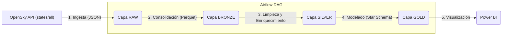

# DSRP-Airflow-Proyecto_Final
Implementación de un a orquestación en Apache Airflow para el curso Airflow de la especialización de Data Engineering del Instituto Data Science Research Peru

# ✈️ Pipeline de Tráfico Aéreo (OpenSky) con Airflow y Arquitectura Medallón

Este proyecto implementa un pipeline de datos ELT (Extract, Load, Transform) de extremo a extremo que ingesta datos de tráfico aéreo en vivo desde la API de **OpenSky Network**, los procesa siguiendo la **Arquitectura Medallón** (Bronce, Silver, Gold) y los modela para ser consumidos por un dashboard en **Power BI**.

El pipeline está completamente orquestado con **Apache Airflow**, utilizando la sintaxis moderna de TaskFlow API (decoradores).

## 🚀 Objetivo

El objetivo es capturar snapshots del estado global del tráfico aéreo a intervalos regulares (cada hora) para construir un modelo de datos que permita analizar la información en un dashboard interactivo.

## 🏛️ Arquitectura

El flujo de datos sigue la Arquitectura Medallón, asegurando la trazabilidad, calidad y reprocesabilidad de los datos.

## 🛠️ Stack Tecnológico y Herramientas

Este proyecto utiliza un conjunto de herramientas modernas de ingeniería de datos para construir el pipeline de principio a fin:

* **Orquestación:**
    * **Apache Airflow (v2.0+):** Utilizado para la orquestación, programación y monitoreo de todo el pipeline. Se implementa la **TaskFlow API** (decoradores `@dag` y `@task`) para una definición de flujos más limpia y moderna.

* **Fuente de Datos:**
    * **OpenSky Network API**: Es la fuente de datos en vivo (endpoint `/states/all`) que provee los snapshots de tráfico aéreo global.

* **Procesamiento y Transformación (ELT):**
    * **Python:** Lenguaje principal utilizado para toda la lógica de ingesta y transformación.
    * **Pandas:** Biblioteca clave para la manipulación, limpieza, enriquecimiento y estructuración de los datos en las capas Bronze y Silver.

* **Almacenamiento (Data Lake):**
    * **Apache Parquet:** Formato de almacenamiento columnar elegido para las capas Bronze, Silver y Gold. Es altamente eficiente para consultas analíticas y ofrece alta compresión.

* **Visualización (Business Intelligence):**
    * **Microsoft Power BI:** Herramienta final para conectarse a la Capa Gold (el Esquema Estrella) y construir el dashboard interactivo que visualiza los KPIs y el tráfico en vivo.

